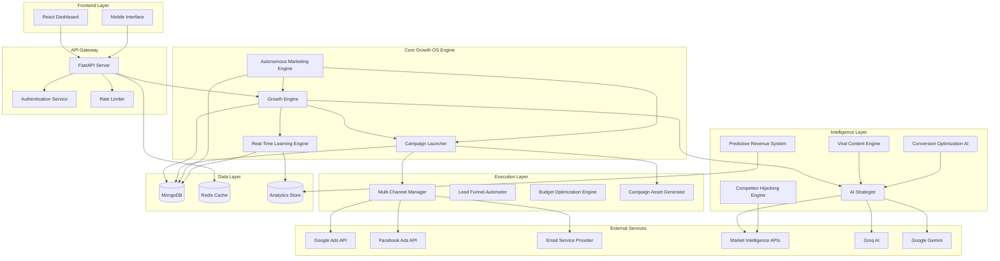

# Design Document: Growth Operating System

## Overview

The Growth Operating System (Growth OS) transforms AstraMark from a marketing intelligence tool into a comprehensive autonomous business growth machine. The system functions as a hybrid CMO + Growth Hacker + Performance Marketer + Data Scientist + Sales Funnel Architect, providing end-to-end marketing automation from strategy generation to campaign execution and optimization.

### Core Value Proposition

The Growth OS replaces an entire marketing team by:
- Generating data-driven marketing strategies with expected ROI
- Launching complete campaigns with one click (ads, landing pages, emails)
- Continuously learning and optimizing from performance data
- Managing multi-channel marketing (SEO, Ads, Social, Email) from a unified platform
- Operating autonomously with minimal human intervention

### Design Philosophy

1. **ROI-First**: Every feature prioritizes measurable business outcomes over vanity metrics
2. **Autonomous by Default**: System operates independently while allowing manual override
3. **Speed to Value**: Users get actionable results within seconds, not days
4. **Intelligence Layer**: AI drives all decisions using real-time market data and learning
5. **Execution-Ready**: All outputs are immediately actionable, not theoretical


## Architecture

### High-Level System Architecture



### Architecture Principles

1. **Microservices-Inspired Modularity**: Each major component (Growth Engine, Campaign Launcher, etc.) operates independently with clear interfaces
2. **AI-First Design**: All intelligence components use AI services (Groq primary, Gemini fallback) for decision-making
3. **Event-Driven Optimization**: Learning Engine monitors events and triggers optimizations asynchronously
4. **Stateless API Layer**: FastAPI handles requests statelessly, with state managed in MongoDB
5. **Caching Strategy**: Redis caches frequently accessed data (market intelligence, benchmarks) to reduce latency


## Components and Interfaces

### 1. Growth Engine (Core Intelligence)

**Purpose**: Central AI brain that generates strategies, predictions, and recommendations.

**Key Responsibilities**:
- Generate daily actionable recommendations with ROI scores
- Predict revenue outcomes for proposed campaigns
- Analyze competitors and suggest counter-strategies
- Generate viral-optimized content
- Optimize conversion rates through AI analysis
- Create automated lead funnels

**Interface**:
```python
class GrowthEngine:
    async def generate_daily_actions(business_id: str) -> List[Dict[str, Any]]
    async def predict_revenue(business_id: str, budget: float, channels: List[str]) -> Dict[str, Any]
    async def generate_campaign_assets(goal: str, business_id: str) -> Dict[str, Any]
    async def analyze_competitors(business_id: str, competitors: List[Dict]) -> Dict[str, Any]
    async def generate_viral_content(business_id: str, topic: str, platform: str) -> List[Dict[str, Any]]
    async def optimize_conversion(page_data: Dict[str, Any]) -> Dict[str, Any]
    async def create_lead_funnel(business_id: str, goal: str) -> Dict[str, Any]
```

**Dependencies**:
- AI Services (Groq, Gemini)
- MongoDB (business profiles, historical data)
- Market Intelligence APIs

**Data Flow**:
1. Receives business context and goal from API
2. Queries historical performance data from MongoDB
3. Calls AI service with structured prompt
4. Parses AI response into actionable format
5. Returns structured recommendations with confidence scores


### 2. Campaign Launcher (Execution Engine)

**Purpose**: One-click campaign creation and deployment across multiple channels.

**Key Responsibilities**:
- Generate complete campaign assets (landing pages, ads, emails)
- Deploy campaigns to advertising platforms
- Configure targeting and budget parameters
- Track campaign status and performance
- Pause/resume campaigns on demand

**Interface**:
```python
class CampaignLauncher:
    async def launch_campaign(business_id: str, goal: str, channels: List[str]) -> Dict[str, Any]
    async def get_campaign_status(campaign_id: str) -> Dict[str, Any]
    async def pause_campaign(campaign_id: str) -> bool
    async def resume_campaign(campaign_id: str) -> bool
    async def _deploy_to_channel(campaign_id: str, channel: str, assets: Dict[str, Any]) -> Dict[str, Any]
```

**Campaign Asset Structure**:
```json
{
  "campaign_name": "string",
  "landing_page": {
    "headline": "string",
    "subheadline": "string",
    "cta_button": "string",
    "body_copy": "string",
    "social_proof": ["string"]
  },
  "ad_creatives": [
    {
      "platform": "Google|Facebook|LinkedIn",
      "headline": "string",
      "description": "string",
      "cta": "string"
    }
  ],
  "email_sequence": [
    {
      "day": 0,
      "subject": "string",
      "body": "string",
      "cta": "string"
    }
  ],
  "targeting": {
    "demographics": "string",
    "interests": ["string"],
    "keywords": ["string"]
  },
  "budget_allocation": {
    "ads": 60,
    "content": 20,
    "email": 20
  }
}
```

**Dependencies**:
- Growth Engine (for asset generation)
- Google Ads API
- Facebook Ads API
- Email Service Provider API
- MongoDB (campaign storage)


### 3. Autonomous Marketing Engine

**Purpose**: Fully automated marketing execution without human intervention.

**Key Responsibilities**:
- Enable/disable autonomous mode per business
- Execute campaigns automatically on schedule
- Optimize active campaigns continuously
- Respect budget limits and safety constraints
- Generate weekly summary reports

**Interface**:
```python
class AutonomousMarketingEngine:
    async def enable_autonomous_mode(business_id: str, config: Dict[str, Any]) -> bool
    async def disable_autonomous_mode(business_id: str) -> bool
    async def run_autonomous_campaigns() -> None  # Scheduled job
    async def optimize_active_campaigns() -> None  # Scheduled job
    async def _execute_action(business_id: str, action: Dict[str, Any]) -> None
    async def _optimize_campaign(campaign: Dict[str, Any]) -> None
```

**Autonomous Configuration**:
```json
{
  "enabled": true,
  "budget_limit": 10000,
  "channels": ["SEO", "Social", "Email"],
  "started_at": "ISO8601 timestamp",
  "safety_constraints": {
    "max_daily_spend": 500,
    "min_roi_threshold": 1.5,
    "pause_on_negative_roi": true
  }
}
```

**Scheduling**:
- Campaign execution: Every 6 hours
- Campaign optimization: Every 1 hour
- Uses APScheduler with AsyncIOScheduler

**Dependencies**:
- Growth Engine (for action generation)
- Campaign Launcher (for execution)
- MongoDB (configuration and logs)


### 4. Real-Time Learning Engine

**Purpose**: Continuously learn from performance data and optimize strategies.

**Key Responsibilities**:
- Monitor campaign performance metrics every 15 minutes
- Identify underperforming campaigns and adjust parameters
- Track improvement metrics and calculate gains
- Identify successful patterns and apply to new campaigns
- Adapt to seasonal trends and market shifts

**Interface**:
```python
class LearningEngine:
    async def analyze_performance(campaign_id: str) -> Dict[str, Any]
    async def optimize_campaign(campaign_id: str, performance_data: Dict) -> Dict[str, Any]
    async def identify_patterns(business_id: str) -> List[Dict[str, Any]]
    async def apply_learnings(campaign_id: str, patterns: List[Dict]) -> bool
    async def track_improvement(campaign_id: str, before: Dict, after: Dict) -> Dict[str, Any]
```

**Learning Metrics**:
```json
{
  "campaign_id": "string",
  "optimization_type": "budget|targeting|creative|timing",
  "before_metrics": {
    "ctr": 0.02,
    "cpc": 1.5,
    "conversion_rate": 0.03,
    "roi": 1.2
  },
  "after_metrics": {
    "ctr": 0.035,
    "cpc": 1.2,
    "conversion_rate": 0.045,
    "roi": 1.8
  },
  "improvement_percentage": 50,
  "confidence_score": 85,
  "applied_at": "ISO8601 timestamp"
}
```

**Optimization Triggers**:
- ROI drops below 1.5x
- CTR drops below industry benchmark
- CPC increases by >20%
- Conversion rate drops by >15%

**Dependencies**:
- MongoDB (performance data)
- Analytics Store (historical metrics)
- Campaign Launcher (for applying optimizations)


### 5. Multi-Channel Manager

**Purpose**: Unified management of SEO, paid ads, social media, and email marketing.

**Key Responsibilities**:
- Manage Google Ads and Facebook Ads campaigns
- Schedule and publish social media content
- Send automated email sequences
- Track cross-channel attribution
- Reallocate budget based on performance

**Interface**:
```python
class MultiChannelManager:
    # SEO Management
    async def track_keywords(business_id: str) -> List[Dict[str, Any]]
    async def generate_seo_content(business_id: str, keywords: List[str]) -> Dict[str, Any]
    
    # Paid Ads Management
    async def create_google_ad(campaign_id: str, ad_data: Dict) -> str
    async def create_facebook_ad(campaign_id: str, ad_data: Dict) -> str
    async def update_ad_budget(ad_id: str, new_budget: float) -> bool
    
    # Social Media Management
    async def schedule_post(platform: str, content: Dict, schedule_time: datetime) -> str
    async def publish_post(post_id: str) -> bool
    
    # Email Marketing
    async def send_email_sequence(lead_id: str, sequence: List[Dict]) -> bool
    async def track_email_engagement(email_id: str) -> Dict[str, Any]
    
    # Attribution
    async def track_conversion(conversion_data: Dict) -> None
    async def calculate_attribution(conversion_id: str) -> Dict[str, Any]
```

**Channel Configuration**:
```json
{
  "seo": {
    "enabled": true,
    "target_keywords": ["keyword1", "keyword2"],
    "content_frequency": "weekly"
  },
  "google_ads": {
    "enabled": true,
    "daily_budget": 100,
    "target_roas": 3.0
  },
  "facebook_ads": {
    "enabled": true,
    "daily_budget": 150,
    "target_cpa": 15
  },
  "social_media": {
    "enabled": true,
    "platforms": ["LinkedIn", "Twitter", "Instagram"],
    "posting_frequency": "daily"
  },
  "email": {
    "enabled": true,
    "provider": "SendGrid",
    "sequences": ["welcome", "nurture", "conversion"]
  }
}
```

**Dependencies**:
- Google Ads API
- Facebook Ads API
- Social Media APIs (LinkedIn, Twitter, Instagram)
- Email Service Provider (SendGrid, Mailchimp)
- MongoDB (channel configurations)


### 6. Predictive Revenue System

**Purpose**: Forecast revenue and ROI before campaign launch.

**Key Responsibilities**:
- Calculate expected ROI for proposed campaigns
- Project revenue ranges with confidence intervals
- Forecast monthly revenue growth
- Display timeline to reach revenue goals

**Interface**:
```python
class PredictiveRevenueSystem:
    async def calculate_roi(business_id: str, budget: float, channels: List[str]) -> Dict[str, Any]
    async def project_revenue(business_id: str, campaign_config: Dict) -> Dict[str, Any]
    async def forecast_growth(business_id: str, months: int) -> List[Dict[str, Any]]
    async def calculate_timeline(business_id: str, target_revenue: float) -> Dict[str, Any]
```

**Revenue Projection Model**:
```json
{
  "investment": 10000,
  "expected_revenue_min": 15000,
  "expected_revenue_max": 25000,
  "expected_roi_percentage": 150,
  "confidence_level": 85,
  "timeline_months": 3,
  "breakdown_by_channel": {
    "google_ads": {
      "revenue": 10000,
      "roi": 2.0
    },
    "facebook_ads": {
      "revenue": 8000,
      "roi": 1.6
    },
    "email": {
      "revenue": 7000,
      "roi": 3.5
    }
  },
  "assumptions": [
    "Average CPC: $1.50",
    "Conversion rate: 3%",
    "Average order value: $50"
  ]
}
```

**Prediction Methodology**:
1. Analyze historical performance data for similar businesses
2. Factor in industry benchmarks for channels
3. Apply machine learning model trained on past campaigns
4. Adjust for market conditions and seasonality
5. Generate confidence intervals using statistical methods

**Dependencies**:
- MongoDB (historical campaign data)
- Analytics Store (industry benchmarks)
- Growth Engine (AI predictions)


### 7. Competitor Hijacking Engine

**Purpose**: Track competitors and identify opportunities to outperform them.

**Key Responsibilities**:
- Monitor competitor websites for changes
- Track competitor ad campaigns
- Analyze competitor landing pages
- Estimate competitor ad spend and traffic
- Suggest counter-strategies

**Interface**:
```python
class CompetitorHijackingEngine:
    async def add_competitor(business_id: str, competitor_url: str) -> str
    async def monitor_competitors(business_id: str) -> List[Dict[str, Any]]
    async def detect_changes(competitor_id: str) -> List[Dict[str, Any]]
    async def analyze_landing_page(competitor_id: str, url: str) -> Dict[str, Any]
    async def estimate_metrics(competitor_id: str) -> Dict[str, Any]
    async def suggest_counter_strategies(business_id: str, competitor_id: str) -> List[Dict[str, Any]]
```

**Competitor Data Model**:
```json
{
  "competitor_id": "string",
  "business_id": "string",
  "name": "Competitor Name",
  "domain": "competitor.com",
  "monitoring_since": "ISO8601 timestamp",
  "last_scan": "ISO8601 timestamp",
  "metrics": {
    "estimated_traffic": "50K/month",
    "estimated_ad_spend": "$5000/month",
    "active_campaigns": 12,
    "top_keywords": ["keyword1", "keyword2"],
    "domain_authority": 45
  },
  "changes_detected": [
    {
      "type": "new_ad_campaign",
      "detected_at": "ISO8601 timestamp",
      "description": "Launched video ads on Facebook",
      "impact": "high"
    }
  ],
  "weaknesses": [
    {
      "weakness": "Poor mobile experience",
      "opportunity": "Target mobile users with optimized landing pages",
      "confidence": 85
    }
  ]
}
```

**Monitoring Schedule**:
- Website changes: Every 24 hours
- Ad campaigns: Every 6 hours
- Keyword rankings: Weekly
- Traffic estimates: Monthly

**Dependencies**:
- APIFY Market Service (web scraping)
- SEMrush/Ahrefs API (SEO data)
- Facebook Ad Library API
- MongoDB (competitor data storage)


### 8. Viral Content Engine

**Purpose**: Generate content optimized for maximum engagement and virality.

**Key Responsibilities**:
- Generate viral-optimized social media posts
- Create content in multiple formats (text, captions, scripts)
- Apply psychological triggers (FOMO, curiosity, social proof)
- Provide virality scores for content
- Suggest optimal posting times

**Interface**:
```python
class ViralContentEngine:
    async def generate_posts(business_id: str, topic: str, platform: str, count: int) -> List[Dict[str, Any]]
    async def score_virality(content: str, platform: str) -> int
    async def suggest_posting_time(business_id: str, platform: str) -> datetime
    async def generate_variations(content: str, count: int) -> List[str]
    async def apply_viral_patterns(content: str, pattern: str) -> str
```

**Viral Content Model**:
```json
{
  "content_id": "string",
  "platform": "LinkedIn|Twitter|Instagram|TikTok",
  "content": "Post text with emojis and formatting",
  "virality_score": 85,
  "psychological_trigger": "FOMO",
  "hashtags": ["#growth", "#marketing"],
  "best_time": "2024-01-15T09:00:00Z",
  "expected_engagement": "500+ likes, 50+ shares",
  "content_type": "text|image_caption|video_script",
  "variations": [
    "Alternative version 1",
    "Alternative version 2"
  ]
}
```

**Viral Patterns**:
- **FOMO (Fear of Missing Out)**: "Only 24 hours left...", "Limited spots available..."
- **Curiosity Gap**: "The one thing nobody tells you about...", "What happened next will surprise you..."
- **Social Proof**: "10,000+ businesses use this...", "Trusted by industry leaders..."
- **Controversy**: "Unpopular opinion:", "Everyone is wrong about..."
- **Storytelling**: Personal narratives with emotional hooks
- **Data-Driven**: "X% of people don't know...", "Studies show..."

**Dependencies**:
- Growth Engine (AI content generation)
- MongoDB (content history)
- Analytics Store (engagement data)


### 9. Conversion Optimization AI

**Purpose**: Automatically optimize conversion rates through AI-driven analysis.

**Key Responsibilities**:
- Analyze landing page performance
- Identify conversion bottlenecks
- Generate A/B test variations
- Automatically implement winning variations
- Optimize CTAs, headlines, and forms

**Interface**:
```python
class ConversionOptimizationAI:
    async def analyze_page(page_url: str, business_id: str) -> Dict[str, Any]
    async def identify_bottlenecks(page_data: Dict) -> List[Dict[str, Any]]
    async def generate_variations(element: str, current: str) -> List[Dict[str, Any]]
    async def run_ab_test(page_id: str, variations: List[Dict]) -> str
    async def implement_winner(test_id: str) -> bool
    async def track_conversion_rate(page_id: str) -> float
```

**Conversion Analysis Model**:
```json
{
  "page_id": "string",
  "current_conversion_rate": 0.03,
  "industry_benchmark": 0.05,
  "bottlenecks": [
    {
      "element": "headline",
      "issue": "Not benefit-focused",
      "impact": "high",
      "confidence": 85
    },
    {
      "element": "cta_button",
      "issue": "Weak call-to-action text",
      "impact": "medium",
      "confidence": 75
    }
  ],
  "optimizations": [
    {
      "element": "headline",
      "current": "Welcome to Our Product",
      "suggested": "Save 10 Hours Per Week with Our Automation Tool",
      "expected_lift": "+25%",
      "reasoning": "Benefit-focused headline with specific value proposition"
    }
  ],
  "ab_test_variations": [
    {
      "variation_name": "Benefit-Focused Headline",
      "changes": ["headline", "subheadline"],
      "expected_winner_probability": 65
    }
  ]
}
```

**Optimization Elements**:
- Headlines and subheadlines
- Call-to-action buttons (text, color, placement)
- Form fields (number, labels, validation)
- Social proof elements (testimonials, logos)
- Page layout and visual hierarchy
- Loading speed and mobile responsiveness

**Dependencies**:
- Growth Engine (AI analysis)
- MongoDB (page data and test results)
- Analytics Store (conversion tracking)


### 10. Lead Funnel Automator

**Purpose**: Create and manage automated lead funnels without manual intervention.

**Key Responsibilities**:
- Create multi-step lead funnels
- Segment leads based on behavior
- Send personalized email sequences
- Score leads by engagement
- Re-engage cold leads

**Interface**:
```python
class LeadFunnelAutomator:
    async def create_funnel(business_id: str, goal: str) -> Dict[str, Any]
    async def add_lead(funnel_id: str, lead_data: Dict) -> str
    async def segment_leads(funnel_id: str) -> Dict[str, List[str]]
    async def send_sequence(lead_id: str, sequence_id: str) -> bool
    async def score_lead(lead_id: str) -> int
    async def move_stage(lead_id: str, new_stage: str) -> bool
    async def reengage_cold_leads(funnel_id: str) -> int
```

**Lead Funnel Model**:
```json
{
  "funnel_id": "string",
  "business_id": "string",
  "goal": "Generate qualified leads for B2B SaaS",
  "stages": [
    {
      "stage": "Awareness",
      "tactics": ["Content marketing", "SEO", "Social ads"],
      "content": ["Blog posts", "Infographics", "Videos"],
      "expected_conversion": "20%"
    },
    {
      "stage": "Interest",
      "tactics": ["Lead magnet", "Webinar", "Email nurture"],
      "content": ["Ebook", "Case studies", "Product demo"],
      "expected_conversion": "40%"
    },
    {
      "stage": "Decision",
      "tactics": ["Free trial", "Consultation", "Comparison guide"],
      "content": ["ROI calculator", "Testimonials", "Pricing page"],
      "expected_conversion": "30%"
    },
    {
      "stage": "Action",
      "tactics": ["Limited offer", "Onboarding", "Success stories"],
      "content": ["Signup form", "Welcome email", "Quick start guide"],
      "expected_conversion": "50%"
    }
  ],
  "email_automation": [
    {
      "trigger": "Lead enters funnel",
      "delay_days": 0,
      "subject": "Welcome! Here's your free guide",
      "content": "Email body with value proposition",
      "goal": "Move to Interest stage"
    },
    {
      "trigger": "Downloaded lead magnet",
      "delay_days": 2,
      "subject": "How [Company] achieved 3x growth",
      "content": "Case study email",
      "goal": "Build trust and credibility"
    }
  ],
  "lead_scoring": {
    "criteria": [
      "Email open: +5 points",
      "Link click: +10 points",
      "Page visit: +15 points",
      "Form submission: +25 points",
      "Demo request: +50 points"
    ],
    "hot_lead_threshold": 75,
    "cold_lead_threshold": 20
  }
}
```

**Lead Data Model**:
```json
{
  "lead_id": "string",
  "funnel_id": "string",
  "email": "lead@example.com",
  "name": "John Doe",
  "company": "Acme Corp",
  "current_stage": "Interest",
  "score": 45,
  "status": "active|cold|converted",
  "entered_at": "ISO8601 timestamp",
  "last_activity": "ISO8601 timestamp",
  "activities": [
    {
      "type": "email_open",
      "timestamp": "ISO8601 timestamp",
      "points": 5
    }
  ],
  "segment": "high_intent|low_intent|nurture"
}
```

**Dependencies**:
- Growth Engine (funnel design)
- Email Service Provider
- MongoDB (funnel and lead data)
- CRM Integration (for lead handoff)


## Data Models

### Business Profile
```python
class BusinessProfile(BaseModel):
    id: str
    user_id: str
    business_type: str
    target_market: str
    monthly_budget: float
    primary_goal: str
    additional_info: Optional[str]
    created_at: datetime
    updated_at: datetime
    
    # Growth OS specific fields
    autonomous_mode_enabled: bool = False
    autonomous_config: Optional[Dict[str, Any]] = None
    active_channels: List[str] = []
    competitors: List[str] = []
```

### Campaign
```python
class Campaign(BaseModel):
    id: str
    business_id: str
    name: str
    goal: str
    channels: List[str]
    status: str  # active, paused, completed, failed
    
    # Assets
    landing_page: Dict[str, Any]
    ad_creatives: List[Dict[str, Any]]
    email_sequence: List[Dict[str, Any]]
    targeting: Dict[str, Any]
    
    # Budget
    total_budget: float
    budget_allocation: Dict[str, float]
    spent: float = 0
    
    # Performance
    impressions: int = 0
    clicks: int = 0
    conversions: int = 0
    revenue: float = 0
    roi: float = 0
    
    # Metadata
    created_at: datetime
    launched_at: Optional[datetime]
    completed_at: Optional[datetime]
    created_by: str  # user or autonomous
```

### Daily Action
```python
class DailyAction(BaseModel):
    id: str
    business_id: str
    action: str
    expected_result: str
    roi_score: int  # 0-100
    time_required: str
    priority: str  # high, medium, low
    channel: str
    status: str  # pending, in_progress, completed, skipped
    created_at: datetime
    completed_at: Optional[datetime]
```

### Learning Update
```python
class LearningUpdate(BaseModel):
    id: str
    campaign_id: str
    optimization_type: str  # budget, targeting, creative, timing
    before_metrics: Dict[str, float]
    after_metrics: Dict[str, float]
    improvement_percentage: float
    confidence_score: int
    applied_at: datetime
    description: str
```

### Competitor
```python
class Competitor(BaseModel):
    id: str
    business_id: str
    name: str
    domain: str
    monitoring_since: datetime
    last_scan: datetime
    
    # Metrics
    estimated_traffic: str
    estimated_ad_spend: str
    active_campaigns: int
    top_keywords: List[str]
    domain_authority: int
    
    # Intelligence
    changes_detected: List[Dict[str, Any]]
    weaknesses: List[Dict[str, Any]]
    strategies: List[Dict[str, Any]]
```

### Lead
```python
class Lead(BaseModel):
    id: str
    funnel_id: str
    business_id: str
    email: str
    name: Optional[str]
    company: Optional[str]
    
    # Funnel tracking
    current_stage: str
    score: int
    status: str  # active, cold, converted, unsubscribed
    
    # Engagement
    entered_at: datetime
    last_activity: datetime
    activities: List[Dict[str, Any]]
    segment: str
    
    # Conversion
    converted: bool = False
    converted_at: Optional[datetime]
    conversion_value: float = 0
```

### Revenue Projection
```python
class RevenueProjection(BaseModel):
    id: str
    business_id: str
    campaign_id: Optional[str]
    
    # Investment
    investment: float
    channels: List[str]
    
    # Projections
    expected_revenue_min: float
    expected_revenue_max: float
    expected_roi_percentage: float
    confidence_level: int
    timeline_months: int
    
    # Breakdown
    breakdown_by_channel: Dict[str, Dict[str, float]]
    assumptions: List[str]
    
    # Metadata
    created_at: datetime
    actual_revenue: Optional[float] = None
    actual_roi: Optional[float] = None
```


## API Endpoint Specifications

### Growth Strategist Endpoints

#### GET /api/growth/daily-actions/{business_id}
Get daily actionable recommendations for a business.

**Response**:
```json
{
  "business_id": "string",
  "date": "2024-01-15",
  "actions": [
    {
      "id": "string",
      "action": "Launch retargeting campaign for cart abandoners",
      "expected_result": "Recover 15-20% of abandoned carts",
      "roi_score": 85,
      "time_required": "2 hours",
      "priority": "high",
      "channel": "Ads"
    }
  ]
}
```

#### POST /api/growth/predict-revenue
Predict revenue for a proposed campaign.

**Request**:
```json
{
  "business_id": "string",
  "budget": 10000,
  "channels": ["Google Ads", "Facebook Ads", "Email"]
}
```

**Response**:
```json
{
  "investment": 10000,
  "expected_revenue_min": 15000,
  "expected_revenue_max": 25000,
  "expected_roi_percentage": 150,
  "confidence_level": 85,
  "timeline_months": 3,
  "breakdown_by_channel": {
    "google_ads": {"revenue": 10000, "roi": 2.0},
    "facebook_ads": {"revenue": 8000, "roi": 1.6},
    "email": {"revenue": 7000, "roi": 3.5}
  }
}
```

### Campaign Launcher Endpoints

#### POST /api/campaigns/launch
Launch a complete campaign with one click.

**Request**:
```json
{
  "business_id": "string",
  "goal": "Get 100 qualified leads",
  "channels": ["Google Ads", "Email"],
  "budget": 5000
}
```

**Response**:
```json
{
  "campaign_id": "string",
  "status": "launched",
  "assets": {
    "landing_page": {...},
    "ad_creatives": [...],
    "email_sequence": [...]
  },
  "deployments": [
    {"channel": "Google Ads", "status": "deployed"},
    {"channel": "Email", "status": "deployed"}
  ]
}
```

#### GET /api/campaigns/{campaign_id}
Get campaign status and performance.

**Response**:
```json
{
  "id": "string",
  "name": "Lead Generation Campaign",
  "status": "active",
  "performance": {
    "impressions": 10000,
    "clicks": 500,
    "conversions": 50,
    "spend": 2500,
    "revenue": 5000,
    "roi": 2.0
  },
  "created_at": "ISO8601",
  "launched_at": "ISO8601"
}
```

#### POST /api/campaigns/{campaign_id}/pause
Pause an active campaign.

#### POST /api/campaigns/{campaign_id}/resume
Resume a paused campaign.

### Autonomous Mode Endpoints

#### POST /api/autonomous/enable
Enable autonomous marketing mode.

**Request**:
```json
{
  "business_id": "string",
  "config": {
    "budget_limit": 10000,
    "channels": ["SEO", "Social", "Email"],
    "safety_constraints": {
      "max_daily_spend": 500,
      "min_roi_threshold": 1.5
    }
  }
}
```

#### POST /api/autonomous/disable
Disable autonomous marketing mode.

**Request**:
```json
{
  "business_id": "string"
}
```

#### GET /api/autonomous/status/{business_id}
Get autonomous mode status and recent actions.

**Response**:
```json
{
  "enabled": true,
  "config": {...},
  "recent_actions": [
    {
      "action": "Launched SEO content campaign",
      "executed_at": "ISO8601",
      "result": "Published 3 blog posts"
    }
  ],
  "performance_summary": {
    "campaigns_launched": 5,
    "total_spend": 3500,
    "total_revenue": 8000,
    "roi": 2.3
  }
}
```


### Competitor Intelligence Endpoints

#### POST /api/competitors/add
Add a competitor to monitor.

**Request**:
```json
{
  "business_id": "string",
  "competitor_url": "https://competitor.com"
}
```

#### GET /api/competitors/{business_id}
Get all monitored competitors and their intelligence.

**Response**:
```json
{
  "competitors": [
    {
      "id": "string",
      "name": "Competitor A",
      "domain": "competitor-a.com",
      "metrics": {
        "estimated_traffic": "50K/month",
        "estimated_ad_spend": "$5000/month",
        "active_campaigns": 12
      },
      "recent_changes": [
        {
          "type": "new_ad_campaign",
          "detected_at": "ISO8601",
          "description": "Launched video ads on Facebook"
        }
      ],
      "weaknesses": [
        {
          "weakness": "Poor mobile experience",
          "opportunity": "Target mobile users"
        }
      ]
    }
  ]
}
```

#### GET /api/competitors/{competitor_id}/strategies
Get suggested strategies to beat a specific competitor.

### Content Generation Endpoints

#### POST /api/content/viral
Generate viral-optimized content.

**Request**:
```json
{
  "business_id": "string",
  "topic": "AI marketing automation",
  "platform": "LinkedIn",
  "count": 5
}
```

**Response**:
```json
{
  "posts": [
    {
      "content": "Post text with formatting",
      "virality_score": 85,
      "hashtags": ["#AI", "#marketing"],
      "best_time": "2024-01-15T09:00:00Z",
      "psychological_trigger": "FOMO",
      "expected_engagement": "500+ likes"
    }
  ]
}
```

#### POST /api/content/campaign-assets
Generate complete campaign assets.

**Request**:
```json
{
  "business_id": "string",
  "goal": "Generate leads for B2B SaaS"
}
```

**Response**:
```json
{
  "campaign_name": "B2B SaaS Lead Generation",
  "landing_page": {...},
  "ad_creatives": [...],
  "email_sequence": [...]
}
```

### Conversion Optimization Endpoints

#### POST /api/conversion/analyze
Analyze a landing page for conversion optimization.

**Request**:
```json
{
  "business_id": "string",
  "page_url": "https://example.com/landing"
}
```

**Response**:
```json
{
  "current_conversion_rate": 0.03,
  "industry_benchmark": 0.05,
  "bottlenecks": [...],
  "optimizations": [...],
  "ab_test_variations": [...]
}
```

#### POST /api/conversion/ab-test
Start an A/B test.

**Request**:
```json
{
  "page_id": "string",
  "variations": [
    {
      "name": "Variation A",
      "changes": {"headline": "New headline"}
    }
  ]
}
```

### Lead Funnel Endpoints

#### POST /api/funnels/create
Create an automated lead funnel.

**Request**:
```json
{
  "business_id": "string",
  "goal": "Generate qualified B2B leads"
}
```

**Response**:
```json
{
  "funnel_id": "string",
  "stages": [...],
  "email_automation": [...],
  "lead_scoring": {...}
}
```

#### POST /api/funnels/{funnel_id}/leads
Add a lead to a funnel.

**Request**:
```json
{
  "email": "lead@example.com",
  "name": "John Doe",
  "company": "Acme Corp"
}
```

#### GET /api/funnels/{funnel_id}/analytics
Get funnel performance analytics.

**Response**:
```json
{
  "total_leads": 500,
  "conversion_by_stage": {
    "Awareness": 0.20,
    "Interest": 0.40,
    "Decision": 0.30,
    "Action": 0.50
  },
  "hot_leads": 45,
  "cold_leads": 120,
  "converted_leads": 75
}
```


## Frontend Component Architecture

### Component Hierarchy

```
Dashboard (Main Container)
├── Header
│   ├── Logo
│   ├── Navigation
│   └── UserMenu
├── GrowthStrategistPanel
│   ├── DailyActionsCard
│   ├── ROIMetricsCard
│   └── RevenueProjectionCard
├── CampaignLauncherPanel
│   ├── QuickLaunchButtons
│   ├── CampaignPreview
│   └── ActiveCampaignsGrid
├── AutonomousModePanel
│   ├── AutonomousToggle
│   ├── ConfigurationForm
│   └── ActivityLog
├── MultiChannelDashboard
│   ├── ChannelPerformanceCards
│   ├── BudgetAllocationChart
│   └── AttributionFlow
├── CompetitorIntelligencePanel
│   ├── CompetitorList
│   ├── ChangeAlerts
│   └── StrategyRecommendations
├── ContentGeneratorPanel
│   ├── ViralContentGenerator
│   ├── ContentCalendar
│   └── PerformanceTracker
├── ConversionOptimizerPanel
│   ├── PageAnalyzer
│   ├── ABTestManager
│   └── OptimizationSuggestions
└── LeadFunnelPanel
    ├── FunnelVisualizer
    ├── LeadList
    └── SequenceEditor
```

### Key Frontend Components

#### 1. GrowthStrategistPanel
**Purpose**: Display AI-generated daily actions and ROI predictions.

**Props**:
```typescript
interface GrowthStrategistPanelProps {
  businessId: string;
  onActionSelect: (action: DailyAction) => void;
}
```

**State**:
```typescript
{
  dailyActions: DailyAction[];
  revenueProjection: RevenueProjection | null;
  loading: boolean;
  error: string | null;
}
```

**Key Features**:
- Real-time action recommendations
- ROI score visualization
- One-click action execution
- Revenue prediction calculator

#### 2. CampaignLauncherPanel
**Purpose**: One-click campaign creation and management.

**Props**:
```typescript
interface CampaignLauncherPanelProps {
  businessId: string;
  onCampaignLaunched: (campaign: Campaign) => void;
}
```

**State**:
```typescript
{
  campaignGoal: string;
  selectedChannels: string[];
  budget: number;
  preview: CampaignAssets | null;
  activeCampaigns: Campaign[];
  launching: boolean;
}
```

**Key Features**:
- Goal-based campaign templates
- Channel selection with recommendations
- Asset preview before launch
- Real-time campaign status

#### 3. AutonomousModePanel
**Purpose**: Configure and monitor autonomous marketing mode.

**Props**:
```typescript
interface AutonomousModePanelProps {
  businessId: string;
  onModeToggle: (enabled: boolean) => void;
}
```

**State**:
```typescript
{
  enabled: boolean;
  config: AutonomousConfig;
  recentActions: AutonomousAction[];
  performanceSummary: PerformanceSummary;
}
```

**Key Features**:
- Toggle autonomous mode
- Configure budget limits and constraints
- View automated actions log
- Performance summary dashboard


#### 4. MultiChannelDashboard
**Purpose**: Unified view of all marketing channels.

**Props**:
```typescript
interface MultiChannelDashboardProps {
  businessId: string;
  dateRange: DateRange;
}
```

**State**:
```typescript
{
  channels: ChannelPerformance[];
  budgetAllocation: BudgetAllocation;
  attribution: AttributionData;
  loading: boolean;
}
```

**Key Features**:
- Channel performance comparison
- Budget allocation visualization
- Cross-channel attribution flow
- Real-time metrics updates

#### 5. CompetitorIntelligencePanel
**Purpose**: Track and analyze competitors.

**Props**:
```typescript
interface CompetitorIntelligencePanelProps {
  businessId: string;
  onCompetitorAdd: (url: string) => void;
}
```

**State**:
```typescript
{
  competitors: Competitor[];
  recentChanges: CompetitorChange[];
  strategies: CounterStrategy[];
  monitoring: boolean;
}
```

**Key Features**:
- Competitor list with metrics
- Real-time change alerts
- Strategy recommendations
- Add/remove competitors

#### 6. ViralContentGenerator
**Purpose**: Generate and schedule viral content.

**Props**:
```typescript
interface ViralContentGeneratorProps {
  businessId: string;
  onContentGenerated: (content: ViralContent[]) => void;
}
```

**State**:
```typescript
{
  topic: string;
  platform: string;
  generatedContent: ViralContent[];
  selectedContent: ViralContent | null;
  generating: boolean;
}
```

**Key Features**:
- Topic and platform selection
- Multiple content variations
- Virality score display
- One-click scheduling

#### 7. ConversionOptimizerPanel
**Purpose**: Analyze and optimize conversion rates.

**Props**:
```typescript
interface ConversionOptimizerPanelProps {
  businessId: string;
  pageUrl: string;
}
```

**State**:
```typescript
{
  analysis: ConversionAnalysis | null;
  activeTests: ABTest[];
  optimizations: Optimization[];
  analyzing: boolean;
}
```

**Key Features**:
- Page analysis with bottlenecks
- A/B test management
- Optimization suggestions
- Automatic implementation

#### 8. LeadFunnelPanel
**Purpose**: Visualize and manage lead funnels.

**Props**:
```typescript
interface LeadFunnelPanelProps {
  businessId: string;
  funnelId: string;
}
```

**State**:
```typescript
{
  funnel: LeadFunnel | null;
  leads: Lead[];
  analytics: FunnelAnalytics;
  selectedLead: Lead | null;
}
```

**Key Features**:
- Funnel stage visualization
- Lead list with scoring
- Email sequence editor
- Conversion analytics


### State Management

The frontend uses React Context API for global state management with the following contexts:

#### GrowthOSContext
```typescript
interface GrowthOSContextValue {
  // Business
  currentBusiness: BusinessProfile | null;
  setCurrentBusiness: (business: BusinessProfile) => void;
  
  // Daily Actions
  dailyActions: DailyAction[];
  refreshDailyActions: () => Promise<void>;
  
  // Campaigns
  activeCampaigns: Campaign[];
  launchCampaign: (goal: string, channels: string[], budget: number) => Promise<Campaign>;
  
  // Autonomous Mode
  autonomousEnabled: boolean;
  toggleAutonomous: (enabled: boolean, config?: AutonomousConfig) => Promise<void>;
  
  // Competitors
  competitors: Competitor[];
  addCompetitor: (url: string) => Promise<void>;
  
  // Loading states
  loading: {
    actions: boolean;
    campaigns: boolean;
    competitors: boolean;
  };
}
```

#### NotificationContext
```typescript
interface NotificationContextValue {
  notifications: Notification[];
  addNotification: (notification: Notification) => void;
  removeNotification: (id: string) => void;
  markAsRead: (id: string) => void;
}
```

### API Client

The frontend uses a centralized API client for all backend communication:

```typescript
class GrowthOSClient {
  private baseURL: string;
  private authToken: string;
  
  // Growth Strategist
  async getDailyActions(businessId: string): Promise<DailyAction[]>;
  async predictRevenue(businessId: string, budget: number, channels: string[]): Promise<RevenueProjection>;
  
  // Campaign Launcher
  async launchCampaign(businessId: string, goal: string, channels: string[], budget: number): Promise<Campaign>;
  async getCampaignStatus(campaignId: string): Promise<Campaign>;
  async pauseCampaign(campaignId: string): Promise<void>;
  async resumeCampaign(campaignId: string): Promise<void>;
  
  // Autonomous Mode
  async enableAutonomous(businessId: string, config: AutonomousConfig): Promise<void>;
  async disableAutonomous(businessId: string): Promise<void>;
  async getAutonomousStatus(businessId: string): Promise<AutonomousStatus>;
  
  // Competitors
  async addCompetitor(businessId: string, url: string): Promise<Competitor>;
  async getCompetitors(businessId: string): Promise<Competitor[]>;
  async getCompetitorStrategies(competitorId: string): Promise<CounterStrategy[]>;
  
  // Content
  async generateViralContent(businessId: string, topic: string, platform: string, count: number): Promise<ViralContent[]>;
  async generateCampaignAssets(businessId: string, goal: string): Promise<CampaignAssets>;
  
  // Conversion
  async analyzeConversion(businessId: string, pageUrl: string): Promise<ConversionAnalysis>;
  async startABTest(pageId: string, variations: ABTestVariation[]): Promise<ABTest>;
  
  // Funnels
  async createFunnel(businessId: string, goal: string): Promise<LeadFunnel>;
  async addLead(funnelId: string, leadData: LeadData): Promise<Lead>;
  async getFunnelAnalytics(funnelId: string): Promise<FunnelAnalytics>;
}
```


## Integration Points with Existing AstraMark Features

### 1. Business Analysis Integration

**Existing Feature**: AstraMark's market analysis and strategy generation

**Integration Approach**:
- Growth OS extends the existing analysis with actionable daily recommendations
- Existing `AnalysisDashboard` component becomes the foundation for `GrowthStrategistPanel`
- Analysis results feed into campaign asset generation
- Market intelligence from existing APIFY integration powers competitor tracking

**Code Changes**:
```python
# In growth_engine.py
async def enhance_analysis_with_actions(analysis_id: str) -> Dict[str, Any]:
    """Enhance existing analysis with Growth OS features"""
    analysis = await db.analyses.find_one({'id': analysis_id})
    
    # Generate daily actions based on analysis
    actions = await generate_daily_actions(analysis['business_id'])
    
    # Add revenue predictions
    revenue_projection = await predict_revenue(
        analysis['business_id'],
        analysis['monthly_budget'],
        [s['channel'] for s in analysis['strategies']]
    )
    
    return {
        **analysis,
        'daily_actions': actions,
        'revenue_projection': revenue_projection
    }
```

### 2. Content Service Integration

**Existing Feature**: Content generation via `ContentGenerationService`

**Integration Approach**:
- Viral Content Engine uses existing content service as foundation
- Adds virality scoring and psychological trigger application
- Extends to support multiple platforms and formats

**Code Changes**:
```python
# In viral_content_engine.py
class ViralContentEngine:
    def __init__(self, content_service: ContentGenerationService):
        self.content_service = content_service
    
    async def generate_viral_posts(self, topic: str, platform: str) -> List[Dict]:
        # Use existing content service
        base_content = await self.content_service.generate_content(topic)
        
        # Apply viral patterns
        viral_posts = []
        for pattern in VIRAL_PATTERNS:
            enhanced = self.apply_viral_pattern(base_content, pattern)
            score = self.calculate_virality_score(enhanced, platform)
            viral_posts.append({
                'content': enhanced,
                'virality_score': score,
                'pattern': pattern
            })
        
        return viral_posts
```

### 3. Authentication and User Management

**Existing Feature**: Auth service with JWT tokens

**Integration Approach**:
- All Growth OS endpoints use existing authentication
- User permissions extended to include autonomous mode access
- Premium features gated by subscription tier

**Code Changes**:
```python
# In server_enhanced.py
@api_router.post("/api/autonomous/enable")
async def enable_autonomous_mode(
    request: AutonomousConfigRequest,
    current_user: UserInDB = Depends(get_current_user)
):
    # Check premium access
    if not current_user.is_premium:
        raise HTTPException(403, "Autonomous mode requires premium subscription")
    
    # Enable autonomous mode
    result = await autonomous_engine.enable_autonomous_mode(
        request.business_id,
        request.config
    )
    
    return {"success": result}
```

### 4. Payment Integration

**Existing Feature**: Unified payment service with Stripe/Razorpay

**Integration Approach**:
- Growth OS features tiered by subscription level
- Autonomous mode and advanced features require premium
- Campaign budget tracking integrated with payment system

**Subscription Tiers**:
```python
GROWTH_OS_TIERS = {
    'free': {
        'daily_actions': 3,
        'campaigns_per_month': 1,
        'autonomous_mode': False,
        'competitors_tracked': 1
    },
    'pro': {
        'daily_actions': 'unlimited',
        'campaigns_per_month': 10,
        'autonomous_mode': True,
        'competitors_tracked': 5
    },
    'enterprise': {
        'daily_actions': 'unlimited',
        'campaigns_per_month': 'unlimited',
        'autonomous_mode': True,
        'competitors_tracked': 'unlimited',
        'white_label': True
    }
}
```


### 5. Database Schema Extensions

**Existing Collections**: businesses, analyses, users

**New Collections**:
```javascript
// campaigns
{
  _id: ObjectId,
  id: "uuid",
  business_id: "uuid",
  name: "string",
  goal: "string",
  channels: ["string"],
  status: "active|paused|completed",
  assets: {...},
  performance: {...},
  created_at: ISODate,
  launched_at: ISODate
}

// daily_actions
{
  _id: ObjectId,
  id: "uuid",
  business_id: "uuid",
  action: "string",
  expected_result: "string",
  roi_score: Number,
  priority: "string",
  status: "pending|completed",
  created_at: ISODate
}

// autonomous_configs
{
  _id: ObjectId,
  business_id: "uuid",
  enabled: Boolean,
  config: {...},
  updated_at: ISODate
}

// autonomous_actions
{
  _id: ObjectId,
  business_id: "uuid",
  action: {...},
  executed_at: ISODate,
  status: "executed|failed"
}

// competitors
{
  _id: ObjectId,
  id: "uuid",
  business_id: "uuid",
  name: "string",
  domain: "string",
  metrics: {...},
  changes_detected: [...],
  last_scan: ISODate
}

// lead_funnels
{
  _id: ObjectId,
  id: "uuid",
  business_id: "uuid",
  goal: "string",
  stages: [...],
  email_automation: [...],
  lead_scoring: {...},
  created_at: ISODate
}

// leads
{
  _id: ObjectId,
  id: "uuid",
  funnel_id: "uuid",
  business_id: "uuid",
  email: "string",
  current_stage: "string",
  score: Number,
  status: "active|cold|converted",
  activities: [...],
  entered_at: ISODate
}

// learning_updates
{
  _id: ObjectId,
  id: "uuid",
  campaign_id: "uuid",
  optimization_type: "string",
  before_metrics: {...},
  after_metrics: {...},
  improvement_percentage: Number,
  applied_at: ISODate
}

// revenue_projections
{
  _id: ObjectId,
  id: "uuid",
  business_id: "uuid",
  investment: Number,
  expected_revenue_min: Number,
  expected_revenue_max: Number,
  confidence_level: Number,
  breakdown_by_channel: {...},
  created_at: ISODate
}
```

**Indexes**:
```javascript
// Performance optimization indexes
db.campaigns.createIndex({ business_id: 1, status: 1 });
db.campaigns.createIndex({ created_at: -1 });
db.daily_actions.createIndex({ business_id: 1, created_at: -1 });
db.autonomous_configs.createIndex({ business_id: 1 });
db.competitors.createIndex({ business_id: 1 });
db.leads.createIndex({ funnel_id: 1, status: 1 });
db.leads.createIndex({ business_id: 1, score: -1 });
db.learning_updates.createIndex({ campaign_id: 1, applied_at: -1 });
```


### 6. Frontend Dashboard Integration

**Existing Component**: `AnalysisDashboard.jsx`

**Integration Strategy**:
- Add new tabs for Growth OS features
- Extend existing cards with Growth OS data
- Maintain backward compatibility with existing analysis flow

**Updated Component Structure**:
```jsx
// Dashboard.jsx
<Tabs defaultValue="strategist">
  <TabsList>
    <TabsTrigger value="strategist">AI Strategist</TabsTrigger>
    <TabsTrigger value="campaigns">Campaigns</TabsTrigger>
    <TabsTrigger value="autonomous">Autonomous Mode</TabsTrigger>
    <TabsTrigger value="competitors">Competitors</TabsTrigger>
    <TabsTrigger value="content">Content</TabsTrigger>
    <TabsTrigger value="funnels">Lead Funnels</TabsTrigger>
  </TabsList>
  
  <TabsContent value="strategist">
    <GrowthStrategistPanel businessId={businessId} />
  </TabsContent>
  
  <TabsContent value="campaigns">
    <CampaignLauncherPanel businessId={businessId} />
  </TabsContent>
  
  {/* ... other tabs */}
</Tabs>
```

**Enhanced Analysis Dashboard**:
```jsx
// AnalysisDashboard.jsx - Enhanced
export function AnalysisDashboard({ analysis }) {
  const [dailyActions, setDailyActions] = useState([]);
  const [revenueProjection, setRevenueProjection] = useState(null);
  
  useEffect(() => {
    // Fetch Growth OS enhancements
    fetchDailyActions(analysis.business_id);
    fetchRevenueProjection(analysis.business_id);
  }, [analysis.business_id]);
  
  return (
    <div>
      {/* Existing analysis sections */}
      <AnalysisOverview analysis={analysis} />
      <StrategiesSection strategies={analysis.strategies} />
      
      {/* New Growth OS sections */}
      <DailyActionsSection actions={dailyActions} />
      <RevenueProjectionSection projection={revenueProjection} />
      <QuickLaunchSection businessId={analysis.business_id} />
    </div>
  );
}
```

### 7. Real-Time Updates

**Integration Approach**:
- Use WebSocket connection for real-time updates
- Push notifications for autonomous actions and competitor changes
- Live campaign performance updates

**WebSocket Events**:
```typescript
enum GrowthOSEvent {
  CAMPAIGN_LAUNCHED = 'campaign:launched',
  CAMPAIGN_OPTIMIZED = 'campaign:optimized',
  AUTONOMOUS_ACTION = 'autonomous:action',
  COMPETITOR_CHANGE = 'competitor:change',
  LEAD_CONVERTED = 'lead:converted',
  PERFORMANCE_UPDATE = 'performance:update'
}

interface WebSocketMessage {
  event: GrowthOSEvent;
  data: any;
  timestamp: string;
}
```

**Frontend WebSocket Handler**:
```typescript
class GrowthOSWebSocket {
  private ws: WebSocket;
  private handlers: Map<GrowthOSEvent, Function[]>;
  
  connect(businessId: string) {
    this.ws = new WebSocket(`wss://api.astramark.com/ws/${businessId}`);
    
    this.ws.onmessage = (event) => {
      const message: WebSocketMessage = JSON.parse(event.data);
      this.handleMessage(message);
    };
  }
  
  on(event: GrowthOSEvent, handler: Function) {
    if (!this.handlers.has(event)) {
      this.handlers.set(event, []);
    }
    this.handlers.get(event)!.push(handler);
  }
  
  private handleMessage(message: WebSocketMessage) {
    const handlers = this.handlers.get(message.event) || [];
    handlers.forEach(handler => handler(message.data));
  }
}
```


## Correctness Properties

*A property is a characteristic or behavior that should hold true across all valid executions of a system—essentially, a formal statement about what the system should do. Properties serve as the bridge between human-readable specifications and machine-verifiable correctness guarantees.*

### Property 1: Daily Actions ROI Ordering

*For any* list of daily actions returned by the AI Strategist, the actions should be sorted by ROI score in descending order (highest ROI first).

**Validates: Requirements 1.2, 1.7**

### Property 2: Recommendation Format Completeness

*For any* recommendation generated by the AI Strategist, the recommendation text should contain both an action component and an expected result component.

**Validates: Requirements 1.3**

### Property 3: Confidence Score Bounds

*For any* recommendation or prediction generated by the Growth OS, the confidence score should be a number between 0 and 100 inclusive.

**Validates: Requirements 1.4**

### Property 4: Campaign Asset Completeness

*For any* campaign launched by the Campaign Launcher, the generated assets should contain all required fields: landing_page, ad_creatives, and email_sequence.

**Validates: Requirements 2.1**

### Property 5: Ad Creatives Per Channel

*For any* campaign with selected channels, the generated ad_creatives array should contain at least one creative for each selected channel.

**Validates: Requirements 2.3**

### Property 6: Email Sequence Minimum Length

*For any* campaign generated by the Campaign Launcher, the email_sequence array should contain at least 3 email messages.

**Validates: Requirements 2.4**

### Property 7: Targeting Configuration Presence

*For any* launched campaign, the targeting object should be non-empty and contain at least one targeting parameter derived from the business profile.

**Validates: Requirements 2.5**

### Property 8: Channel Deployment Completeness

*For any* campaign launched with selected channels, there should be a deployment record for each selected channel in the deployments array.

**Validates: Requirements 2.6**

### Property 9: Deployment Failure Logging

*For any* campaign deployment that fails on a channel, there should be an error log entry and the deployment status should be marked as "failed".

**Validates: Requirements 2.9**

### Property 10: Underperformance Triggers Optimization

*For any* campaign where ROI drops below the threshold (1.5), the Learning Engine should create an optimization action.

**Validates: Requirements 3.2**

### Property 11: Optimization Metrics Tracking

*For any* optimization performed by the Learning Engine, there should be a learning update record containing before_metrics, after_metrics, and improvement_percentage.

**Validates: Requirements 3.3, 3.4**

### Property 12: Learning Update Completeness

*For any* learning update displayed to the user, it should contain a description of the improvement and impact metrics showing the change.

**Validates: Requirements 3.7**

### Property 13: Channel Recommendation Presence

*For any* campaign creation request, the Multi-Channel Manager should return channel recommendations based on the provided budget and goals.

**Validates: Requirements 4.5**

### Property 14: Conversion Attribution Tracking

*For any* conversion event, there should be attribution data containing at least one touchpoint with channel information.

**Validates: Requirements 4.7**

### Property 15: Budget Reallocation on Underperformance

*For any* channel whose ROI drops below the average ROI across all channels, the Multi-Channel Manager should reduce its budget allocation in the next optimization cycle.

**Validates: Requirements 4.8**

### Property 16: Revenue Projection Completeness

*For any* revenue prediction request, the response should contain investment amount, expected_revenue_min, expected_revenue_max, and confidence_level fields.

**Validates: Requirements 5.1, 5.2, 5.4**

### Property 17: Revenue Projection Format

*For any* revenue projection displayed to the user, the text should match the format "Spend ₹X → Expected ₹Y return" where X is the investment and Y is the expected revenue.

**Validates: Requirements 5.3**

### Property 18: Monthly Growth Forecast Presence

*For any* revenue forecast request, the response should include monthly growth data for the specified number of months.

**Validates: Requirements 5.5**

### Property 19: Timeline to Goal Presence

*For any* revenue projection, there should be a timeline_months field indicating the expected time to reach the revenue goal.

**Validates: Requirements 5.8**

### Property 20: Competitor Metrics Completeness

*For any* tracked competitor, the competitor data should include estimated_ad_spend, estimated_traffic, and top_keywords fields.

**Validates: Requirements 6.6, 6.7**

### Property 21: Competitor Weakness Analysis

*For any* competitor analysis, there should be a weaknesses array containing identified weaknesses.

**Validates: Requirements 6.4**

### Property 22: Counter-Strategy Generation

*For any* competitor with identified weaknesses, there should be corresponding counter-strategies suggested to exploit those weaknesses.

**Validates: Requirements 6.5**

### Property 23: Competitor Insights Actionability

*For any* competitor insight view, there should be at least one actionable recommendation to outperform the competitor.

**Validates: Requirements 6.8**

### Property 24: Viral Content Generation

*For any* viral content generation request, the response should contain at least one post with content, virality_score, and psychological_trigger fields.

**Validates: Requirements 7.1, 7.3**

### Property 25: Virality Score Bounds

*For any* generated viral content, the virality_score should be a number between 0 and 100 inclusive.

**Validates: Requirements 7.4**

### Property 26: Posting Time Suggestion

*For any* generated viral content, there should be a best_time field suggesting the optimal posting time.

**Validates: Requirements 7.5**

### Property 27: Content Variations Generation

*For any* content generation request with count parameter N where N > 1, the response should contain at least N different content variations.

**Validates: Requirements 7.6**

### Property 28: Hashtag Inclusion

*For any* generated viral content, there should be a hashtags array containing relevant hashtags for the business.

**Validates: Requirements 7.9**

### Property 29: Conversion Bottleneck Identification

*For any* landing page analysis, the response should contain a bottlenecks array identifying conversion issues.

**Validates: Requirements 8.1**

### Property 30: Below-Benchmark Optimization Suggestions

*For any* conversion analysis where current_conversion_rate is less than industry_benchmark, there should be optimization suggestions provided.

**Validates: Requirements 8.2**

### Property 31: A/B Test Variation Generation

*For any* conversion optimization request, the response should include ab_test_variations array with at least one test variation.

**Validates: Requirements 8.3**

### Property 32: Optimization Element Coverage

*For any* conversion optimization, the suggested changes should include at least one of: call-to-action, headline, or form field optimizations.

**Validates: Requirements 8.5**

### Property 33: Conversion Source Tracking

*For any* conversion tracking data, there should be source information indicating where the conversion originated.

**Validates: Requirements 8.6**

### Property 34: Expected Impact Presence

*For any* optimization suggestion, there should be an expected_lift field indicating the projected improvement percentage.

**Validates: Requirements 8.7**

### Property 35: Multi-Stage Funnel Creation

*For any* lead funnel created by the Funnel Automator, the stages array should contain at least 2 stages.

**Validates: Requirements 9.1**

### Property 36: Lead Segmentation

*For any* lead added to a funnel, there should be a segment field categorizing the lead.

**Validates: Requirements 9.2**

### Property 37: Lead Stage Tracking

*For any* lead in a funnel, there should be a current_stage field indicating their position in the funnel.

**Validates: Requirements 9.4**

### Property 38: Lead Scoring

*For any* lead in a funnel, there should be a score field representing their engagement level.

**Validates: Requirements 9.5**

### Property 39: Hot Lead Notification

*For any* lead whose score reaches or exceeds the hot_lead_threshold, a notification should be created for the user.

**Validates: Requirements 9.6**

### Property 40: Funnel Stage Conversion Rates

*For any* funnel analytics request, the response should include conversion rates for each stage in the funnel.

**Validates: Requirements 9.9**

### Property 41: Autonomous Campaign Execution

*For any* business with autonomous mode enabled, when the scheduled execution time arrives, at least one campaign action should be executed automatically.

**Validates: Requirements 10.2**

### Property 42: Performance-Based Budget Allocation

*For any* autonomous budget allocation, channels with higher ROI should receive proportionally more budget than channels with lower ROI.

**Validates: Requirements 10.3**

### Property 43: Budget Limit Enforcement

*For any* autonomous action, the total spend across all campaigns should not exceed the configured budget_limit.

**Validates: Requirements 10.8**

### Property 44: Critical Error Autonomous Pause

*For any* critical error detected during autonomous operation, the autonomous mode should be automatically disabled and an alert should be sent to the user.

**Validates: Requirements 10.9**

### Property 45: Autonomous Campaign Attribution

*For any* campaign created by the autonomous engine, the created_by field should be set to "autonomous" to distinguish it from manual campaigns.

**Validates: Requirements 10.10**

### Property 46: Ad Creative Structure

*For any* campaign assets generated, each ad creative in the ad_creatives array should contain headline and description fields.

**Validates: Requirements 11.1**

### Property 47: Landing Page HTML Presence

*For any* campaign assets generated, the landing_page object should contain HTML content or structured page data.

**Validates: Requirements 11.2**

### Property 48: Email Sequence Structure

*For any* campaign assets generated, each email in the email_sequence array should contain subject and body fields.

**Validates: Requirements 11.3**

### Property 49: Asset Variation Generation

*For any* asset generation request, multiple variations of each asset type should be created for A/B testing purposes.

**Validates: Requirements 11.5**

### Property 50: CTA Button Presence

*For any* generated landing page, there should be a cta_button field containing the call-to-action text.

**Validates: Requirements 11.7**

### Property 51: Revenue Attribution Channel Tracking

*For any* conversion with revenue attribution, the attribution data should include channel information for all touchpoints.

**Validates: Requirements 12.1**

### Property 52: Multi-Touch Attribution

*For any* conversion using multi-touch attribution, the attribution data should include at least one touchpoint, and ideally multiple touchpoints in the customer journey.

**Validates: Requirements 12.2**

### Property 53: Customer Journey Touchpoint Recording

*For any* conversion event, there should be a touchpoints array recording all marketing interactions that led to the conversion.

**Validates: Requirements 12.3**

### Property 54: Channel CAC Calculation

*For any* channel performance data, there should be a calculated customer acquisition cost (CAC) value.

**Validates: Requirements 12.5**

### Property 55: LTV Tracking

*For any* converted customer, there should be lifetime value (LTV) tracking data.

**Validates: Requirements 12.6**

### Property 56: Complete Journey Display

*For any* attribution data view, all recorded touchpoints in the customer journey should be displayed.

**Validates: Requirements 12.7**

### Property 57: Traffic Source Ranking

*For any* attribution analysis, traffic sources and campaigns should be ranked by their revenue contribution in descending order.

**Validates: Requirements 12.8**

### Property 58: Market Signal Display

*For any* market intelligence view, there should be market signals displayed including competitive moves or consumer shifts.

**Validates: Requirements 13.2**

### Property 59: Keyword Trend Tracking

*For any* keyword tracking request, the response should include search volume trend data over time.

**Validates: Requirements 13.4**

### Property 60: Sentiment Monitoring

*For any* brand or competitor sentiment monitoring, there should be sentiment scores or sentiment data available.

**Validates: Requirements 13.5**

### Property 61: Benchmark Availability

*For any* performance metric displayed, there should be a corresponding industry benchmark value for comparison.

**Validates: Requirements 13.6**

### Property 62: Declining ROI Budget Reduction

*For any* budget optimization where a channel shows declining ROI over time, that channel's budget allocation should be reduced.

**Validates: Requirements 14.2**

### Property 63: High-Performance Budget Increase

*For any* budget reallocation, channels with ROI above the average should receive increased budget allocation.

**Validates: Requirements 14.3**

### Property 64: Budget Constraint Enforcement

*For any* channel budget allocation, the allocated budget should be within the configured minimum and maximum constraints for that channel.

**Validates: Requirements 14.4**

### Property 65: Budget Recommendation ROI Impact

*For any* budget recommendation, there should be an expected_roi field indicating the projected return on investment.

**Validates: Requirements 14.5**

### Property 66: Total Budget Distribution

*For any* budget distribution across channels, the sum of all channel budgets should equal the total budget set by the user.

**Validates: Requirements 14.6**

### Property 67: Budget Overrun Alert

*For any* campaign where actual spend exceeds the allocated budget, an alert should be created and sent to the user.

**Validates: Requirements 14.7**

### Property 68: Revenue Goal Budget Forecast

*For any* specific revenue goal, there should be a budget forecast indicating the investment needed to achieve that goal.

**Validates: Requirements 14.8**

### Property 69: KPI Benchmark Availability

*For any* key performance indicator (KPI) displayed, there should be an industry benchmark value available for comparison.

**Validates: Requirements 15.1**

### Property 70: Below-Benchmark Improvement Suggestions

*For any* performance metric that falls below its industry benchmark, there should be improvement strategies suggested.

**Validates: Requirements 15.5**

### Property 71: Benchmark Segmentation

*For any* benchmark data, there should be segmentation metadata indicating industry, business size, or market segment.

**Validates: Requirements 15.6**

### Property 72: Integration Failure Logging

*For any* integration failure with external platforms, there should be an error log entry and a notification sent to the user.

**Validates: Requirements 16.7**

### Property 73: White-Label Branding Removal

*For any* white-label configuration where white-label mode is enabled, AstraMark branding should not appear in any API responses or communications.

**Validates: Requirements 18.1**

### Property 74: Agency Multi-Client Dashboard

*For any* agency user account, the dashboard should display data for multiple client accounts.

**Validates: Requirements 18.4**

### Property 75: White-Label Communication Branding

*For any* communication sent in white-label mode, the agency's branding should be used instead of AstraMark branding.

**Validates: Requirements 18.6**

### Property 76: Data Deletion Completeness

*For any* user data deletion request, all personal data associated with that user should be removed from the database.

**Validates: Requirements 19.3**

### Property 77: Data Access Audit Logging

*For any* access to user data, there should be an audit log entry recording the access time, user, and data accessed.

**Validates: Requirements 19.8**

### Property 78: Onboarding Progress Tracking

*For any* user account, there should be onboarding progress tracking indicating which steps have been completed.

**Validates: Requirements 20.5**

### Property 79: Post-Onboarding Campaign Launch

*For any* user who completes the onboarding process, a first campaign should be automatically created.

**Validates: Requirements 20.7**


## Error Handling

### Error Categories

The Growth OS implements comprehensive error handling across four categories:

#### 1. User Input Errors (4xx)
- **400 Bad Request**: Invalid campaign parameters, missing required fields
- **401 Unauthorized**: Invalid or expired authentication token
- **403 Forbidden**: Insufficient permissions (e.g., autonomous mode requires premium)
- **404 Not Found**: Campaign, business, or competitor not found
- **429 Too Many Requests**: Rate limit exceeded

**Handling Strategy**:
- Validate all inputs at API boundary
- Return descriptive error messages with field-level details
- Log validation failures for monitoring
- Suggest corrections in error response

**Example Error Response**:
```json
{
  "error": "ValidationError",
  "message": "Invalid campaign parameters",
  "details": {
    "budget": "Budget must be greater than 0",
    "channels": "At least one channel must be selected"
  },
  "suggestion": "Please provide a valid budget and select at least one marketing channel"
}
```

#### 2. AI Service Errors (5xx)
- **503 Service Unavailable**: AI service (Groq/Gemini) temporarily unavailable
- **504 Gateway Timeout**: AI service response timeout
- **500 Internal Server Error**: AI service returned invalid response

**Handling Strategy**:
- Implement automatic fallback: Groq → Gemini → Mock data
- Retry with exponential backoff (max 3 attempts)
- Cache recent AI responses for emergency fallback
- Degrade gracefully with reduced functionality

**Fallback Chain**:
```python
async def call_ai_with_fallback(prompt: str) -> Dict:
    try:
        return await groq_service.generate(prompt)
    except Exception as e:
        logger.warning(f"Groq failed: {e}, falling back to Gemini")
        try:
            return await gemini_service.generate(prompt)
        except Exception as e2:
            logger.error(f"All AI services failed: {e2}")
            return get_cached_or_mock_response(prompt)
```

#### 3. External Integration Errors
- **Integration Timeout**: External API (Google Ads, Facebook) timeout
- **Authentication Failure**: Invalid API credentials
- **Rate Limit**: External service rate limit exceeded
- **Service Degradation**: External service partially unavailable

**Handling Strategy**:
- Implement circuit breaker pattern
- Queue failed operations for retry
- Notify user of integration issues
- Continue with available integrations

**Circuit Breaker Implementation**:
```python
class IntegrationCircuitBreaker:
    def __init__(self, failure_threshold=5, timeout=60):
        self.failure_count = 0
        self.failure_threshold = failure_threshold
        self.timeout = timeout
        self.last_failure_time = None
        self.state = "closed"  # closed, open, half-open
    
    async def call(self, func, *args, **kwargs):
        if self.state == "open":
            if time.time() - self.last_failure_time > self.timeout:
                self.state = "half-open"
            else:
                raise CircuitBreakerOpenError("Integration temporarily disabled")
        
        try:
            result = await func(*args, **kwargs)
            if self.state == "half-open":
                self.state = "closed"
                self.failure_count = 0
            return result
        except Exception as e:
            self.failure_count += 1
            self.last_failure_time = time.time()
            if self.failure_count >= self.failure_threshold:
                self.state = "open"
            raise
```

#### 4. Data Consistency Errors
- **Concurrent Modification**: Campaign modified by multiple processes
- **Budget Exceeded**: Autonomous mode exceeds budget limits
- **Invalid State Transition**: Campaign state change not allowed
- **Data Corruption**: Malformed data in database

**Handling Strategy**:
- Use optimistic locking for concurrent updates
- Implement budget checks before spending
- Validate state transitions
- Run data integrity checks periodically

**Optimistic Locking Example**:
```python
async def update_campaign_with_lock(campaign_id: str, updates: Dict) -> bool:
    campaign = await db.campaigns.find_one({'id': campaign_id})
    if not campaign:
        raise NotFoundError("Campaign not found")
    
    version = campaign.get('version', 0)
    
    result = await db.campaigns.update_one(
        {'id': campaign_id, 'version': version},
        {
            '$set': {**updates, 'version': version + 1},
            '$currentDate': {'updated_at': True}
        }
    )
    
    if result.modified_count == 0:
        raise ConcurrentModificationError("Campaign was modified by another process")
    
    return True
```

### Error Recovery Strategies

#### Autonomous Mode Error Recovery
When autonomous mode encounters errors:
1. **Minor Errors**: Log and continue with next action
2. **Moderate Errors**: Pause specific channel, continue others
3. **Critical Errors**: Disable autonomous mode, alert user

```python
async def handle_autonomous_error(error: Exception, severity: str):
    if severity == "minor":
        logger.warning(f"Autonomous minor error: {error}")
        await db.autonomous_logs.insert_one({
            'error': str(error),
            'severity': 'minor',
            'timestamp': datetime.now(timezone.utc)
        })
    elif severity == "moderate":
        logger.error(f"Autonomous moderate error: {error}")
        await pause_channel(error.channel)
        await notify_user(f"Channel {error.channel} paused due to error")
    else:  # critical
        logger.critical(f"Autonomous critical error: {error}")
        await disable_autonomous_mode(error.business_id)
        await notify_user("Autonomous mode disabled due to critical error", urgent=True)
```

#### Campaign Launch Error Recovery
If campaign launch fails:
1. Rollback any partial deployments
2. Save campaign as draft
3. Notify user with specific failure reason
4. Offer manual retry option

```python
async def launch_campaign_with_rollback(campaign_data: Dict) -> Dict:
    deployed_channels = []
    try:
        for channel in campaign_data['channels']:
            await deploy_to_channel(campaign_data['id'], channel)
            deployed_channels.append(channel)
        
        return {'status': 'success', 'campaign_id': campaign_data['id']}
    
    except Exception as e:
        # Rollback deployed channels
        for channel in deployed_channels:
            await rollback_channel_deployment(campaign_data['id'], channel)
        
        # Save as draft
        await db.campaigns.update_one(
            {'id': campaign_data['id']},
            {'$set': {'status': 'draft', 'error': str(e)}}
        )
        
        raise CampaignLaunchError(f"Campaign launch failed: {e}")
```

### Monitoring and Alerting

**Error Metrics Tracked**:
- Error rate by endpoint
- AI service failure rate
- Integration failure rate
- Autonomous mode error rate
- Average error recovery time

**Alert Thresholds**:
- Error rate > 5%: Warning
- Error rate > 10%: Critical
- AI service down > 5 minutes: Critical
- Autonomous mode disabled: Immediate notification


## Testing Strategy

### Dual Testing Approach

The Growth OS requires both unit testing and property-based testing for comprehensive coverage:

- **Unit tests**: Verify specific examples, edge cases, and error conditions
- **Property tests**: Verify universal properties across all inputs
- Together they provide comprehensive coverage: unit tests catch concrete bugs, property tests verify general correctness

### Unit Testing

**Focus Areas**:
- Specific examples demonstrating correct behavior
- Integration points between components
- Edge cases and error conditions
- API endpoint request/response validation

**Example Unit Tests**:

```python
# test_growth_engine.py
import pytest
from growth_engine import GrowthEngine

@pytest.mark.asyncio
async def test_generate_daily_actions_returns_list():
    """Test that daily actions returns a list"""
    engine = GrowthEngine(mock_db, mock_ai)
    actions = await engine.generate_daily_actions("business_123")
    assert isinstance(actions, list)

@pytest.mark.asyncio
async def test_predict_revenue_with_zero_budget():
    """Edge case: zero budget should return zero revenue"""
    engine = GrowthEngine(mock_db, mock_ai)
    result = await engine.predict_revenue("business_123", 0, ["SEO"])
    assert result['expected_revenue_min'] == 0
    assert result['expected_revenue_max'] == 0

@pytest.mark.asyncio
async def test_campaign_launch_with_invalid_channel():
    """Error case: invalid channel should raise error"""
    launcher = CampaignLauncher(mock_db, mock_engine)
    with pytest.raises(ValueError):
        await launcher.launch_campaign("business_123", "goal", ["InvalidChannel"], 1000)
```

**Unit Test Coverage Goals**:
- API endpoints: 90%+
- Core business logic: 85%+
- Error handling: 80%+
- Integration code: 70%+

### Property-Based Testing

**Property Test Library**: Use `hypothesis` for Python backend, `fast-check` for TypeScript frontend

**Configuration**:
- Minimum 100 iterations per property test
- Each test references its design document property
- Tag format: `# Feature: growth-operating-system, Property {number}: {property_text}`

**Example Property Tests**:

```python
# test_properties.py
from hypothesis import given, strategies as st
import pytest

# Feature: growth-operating-system, Property 1: Daily Actions ROI Ordering
@given(st.lists(st.integers(min_value=0, max_value=100), min_size=2))
@pytest.mark.asyncio
async def test_daily_actions_roi_ordering(roi_scores):
    """For any list of daily actions, they should be sorted by ROI descending"""
    # Generate mock actions with given ROI scores
    actions = [
        {'action': f'Action {i}', 'roi_score': score}
        for i, score in enumerate(roi_scores)
    ]
    
    # Simulate AI returning unsorted actions
    mock_ai.set_response(actions)
    
    engine = GrowthEngine(mock_db, mock_ai)
    result = await engine.generate_daily_actions("business_123")
    
    # Verify ordering
    for i in range(len(result) - 1):
        assert result[i]['roi_score'] >= result[i+1]['roi_score']

# Feature: growth-operating-system, Property 3: Confidence Score Bounds
@given(st.text(), st.integers())
@pytest.mark.asyncio
async def test_confidence_score_bounds(action_text, random_score):
    """For any recommendation, confidence score should be 0-100"""
    mock_ai.set_response({'action': action_text, 'confidence': random_score})
    
    engine = GrowthEngine(mock_db, mock_ai)
    result = await engine.generate_daily_actions("business_123")
    
    for action in result:
        assert 0 <= action['confidence_score'] <= 100

# Feature: growth-operating-system, Property 6: Email Sequence Minimum Length
@given(st.text(), st.lists(st.text(), min_size=0, max_size=10))
@pytest.mark.asyncio
async def test_email_sequence_minimum_length(goal, channels):
    """For any campaign, email sequence should have at least 3 messages"""
    launcher = CampaignLauncher(mock_db, mock_engine)
    result = await launcher.launch_campaign("business_123", goal, channels, 1000)
    
    assert len(result['assets']['email_sequence']) >= 3

# Feature: growth-operating-system, Property 43: Budget Limit Enforcement
@given(
    st.floats(min_value=1000, max_value=100000),
    st.lists(st.floats(min_value=100, max_value=5000), min_size=1, max_size=10)
)
@pytest.mark.asyncio
async def test_autonomous_budget_limit_enforcement(budget_limit, campaign_spends):
    """For any autonomous actions, total spend should not exceed budget limit"""
    config = {'budget_limit': budget_limit}
    await autonomous_engine.enable_autonomous_mode("business_123", config)
    
    # Simulate multiple campaign spends
    total_spend = 0
    for spend in campaign_spends:
        if total_spend + spend <= budget_limit:
            await autonomous_engine._execute_action("business_123", {'spend': spend})
            total_spend += spend
        else:
            # Should reject action that exceeds budget
            with pytest.raises(BudgetExceededError):
                await autonomous_engine._execute_action("business_123", {'spend': spend})
            break
    
    # Verify total spend
    campaigns = await db.campaigns.find({'business_id': 'business_123'}).to_list(None)
    actual_total = sum(c.get('spent', 0) for c in campaigns)
    assert actual_total <= budget_limit

# Feature: growth-operating-system, Property 66: Total Budget Distribution
@given(
    st.floats(min_value=1000, max_value=100000),
    st.lists(st.text(min_size=3, max_size=20), min_size=2, max_size=5)
)
@pytest.mark.asyncio
async def test_total_budget_distribution(total_budget, channels):
    """For any budget distribution, sum of channel budgets should equal total"""
    multi_channel = MultiChannelManager(mock_db)
    allocation = await multi_channel.allocate_budget(total_budget, channels)
    
    channel_sum = sum(allocation.values())
    assert abs(channel_sum - total_budget) < 0.01  # Allow for floating point precision
```

### Integration Testing

**Focus Areas**:
- End-to-end campaign launch flow
- Autonomous mode execution cycle
- Multi-channel deployment
- AI service fallback chain
- Database transactions

**Example Integration Test**:

```python
@pytest.mark.integration
@pytest.mark.asyncio
async def test_complete_campaign_launch_flow():
    """Test complete flow from business profile to campaign deployment"""
    # 1. Create business profile
    business = await create_business_profile({
        'business_type': 'B2B SaaS',
        'target_market': 'Small businesses',
        'monthly_budget': 5000,
        'primary_goal': 'Generate leads'
    })
    
    # 2. Generate daily actions
    actions = await growth_engine.generate_daily_actions(business['id'])
    assert len(actions) > 0
    
    # 3. Launch campaign based on top action
    top_action = actions[0]
    campaign = await campaign_launcher.launch_campaign(
        business['id'],
        top_action['action'],
        ['Google Ads', 'Email'],
        2000
    )
    
    # 4. Verify campaign created
    assert campaign['status'] == 'launched'
    assert len(campaign['assets']['ad_creatives']) >= 2
    assert len(campaign['assets']['email_sequence']) >= 3
    
    # 5. Verify deployments
    assert len(campaign['deployments']) == 2
    for deployment in campaign['deployments']:
        assert deployment['status'] == 'deployed'
    
    # 6. Verify database state
    db_campaign = await db.campaigns.find_one({'id': campaign['campaign_id']})
    assert db_campaign is not None
    assert db_campaign['status'] == 'active'
```

### Performance Testing

**Key Metrics**:
- API response time < 500ms (p95)
- Campaign launch time < 30 seconds
- Daily actions generation < 5 seconds
- Dashboard load time < 3 seconds
- Autonomous cycle execution < 10 minutes

**Load Testing**:
- Concurrent users: 100+
- Requests per second: 50+
- Campaign launches per hour: 100+

**Example Performance Test**:

```python
@pytest.mark.performance
@pytest.mark.asyncio
async def test_daily_actions_performance():
    """Test that daily actions generation completes within 5 seconds"""
    import time
    
    start = time.time()
    actions = await growth_engine.generate_daily_actions("business_123")
    duration = time.time() - start
    
    assert duration < 5.0, f"Daily actions took {duration}s, expected < 5s"
    assert len(actions) > 0
```

### Frontend Testing

**Component Testing** (React Testing Library):
```typescript
// GrowthStrategistPanel.test.tsx
import { render, screen, waitFor } from '@testing-library/react';
import { GrowthStrategistPanel } from './GrowthStrategistPanel';

test('displays daily actions sorted by ROI', async () => {
  const mockActions = [
    { action: 'Action 1', roi_score: 85 },
    { action: 'Action 2', roi_score: 92 },
    { action: 'Action 3', roi_score: 78 }
  ];
  
  mockAPI.getDailyActions.mockResolvedValue(mockActions);
  
  render(<GrowthStrategistPanel businessId="123" />);
  
  await waitFor(() => {
    const actions = screen.getAllByTestId('daily-action');
    expect(actions[0]).toHaveTextContent('Action 2'); // Highest ROI first
    expect(actions[1]).toHaveTextContent('Action 1');
    expect(actions[2]).toHaveTextContent('Action 3');
  });
});
```

**Property-Based Frontend Testing** (fast-check):
```typescript
// properties.test.ts
import fc from 'fast-check';
import { sortActionsByROI } from './utils';

// Feature: growth-operating-system, Property 1: Daily Actions ROI Ordering
test('actions are always sorted by ROI descending', () => {
  fc.assert(
    fc.property(
      fc.array(fc.record({
        action: fc.string(),
        roi_score: fc.integer({ min: 0, max: 100 })
      }), { minLength: 2 }),
      (actions) => {
        const sorted = sortActionsByROI(actions);
        
        for (let i = 0; i < sorted.length - 1; i++) {
          expect(sorted[i].roi_score).toBeGreaterThanOrEqual(sorted[i + 1].roi_score);
        }
      }
    ),
    { numRuns: 100 }
  );
});
```

### Test Execution

**CI/CD Pipeline**:
1. Unit tests: Run on every commit
2. Property tests: Run on every commit (100 iterations)
3. Integration tests: Run on PR merge
4. Performance tests: Run nightly
5. E2E tests: Run before production deployment

**Test Commands**:
```bash
# Backend
pytest tests/unit/              # Unit tests
pytest tests/properties/        # Property tests (100 iterations)
pytest tests/integration/       # Integration tests
pytest tests/performance/       # Performance tests

# Frontend
npm test                        # Unit + property tests
npm run test:e2e               # End-to-end tests
npm run test:performance       # Performance tests
```

